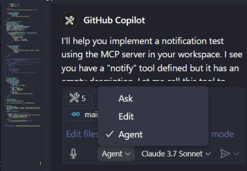
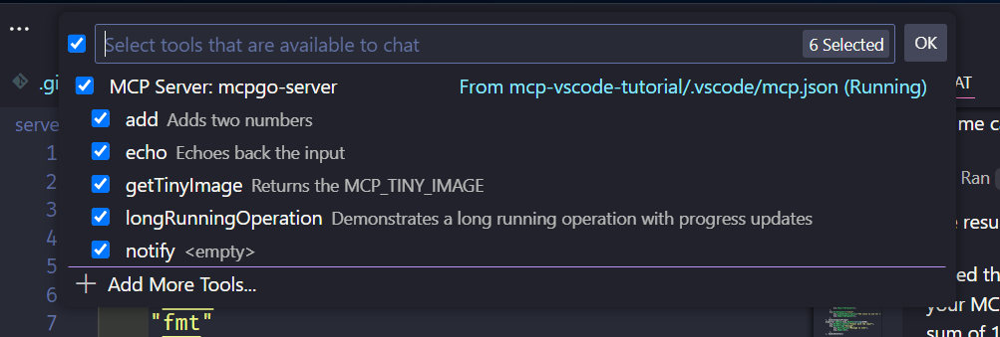
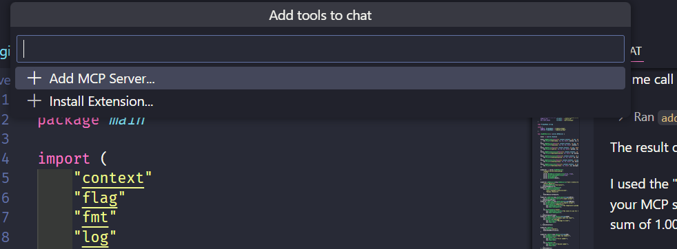
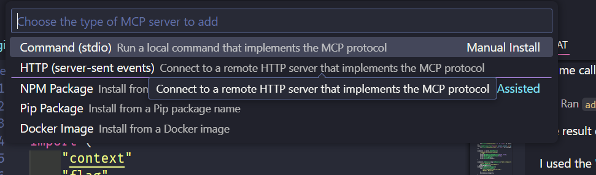
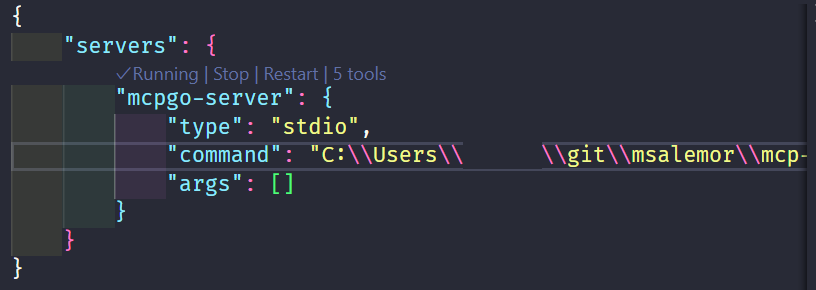
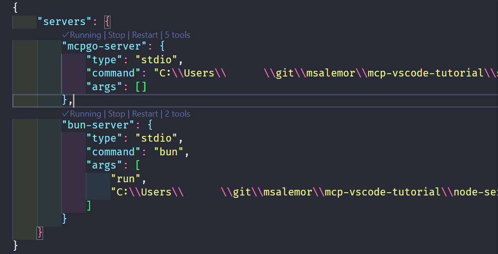
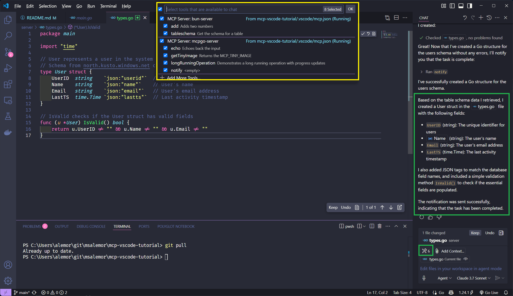
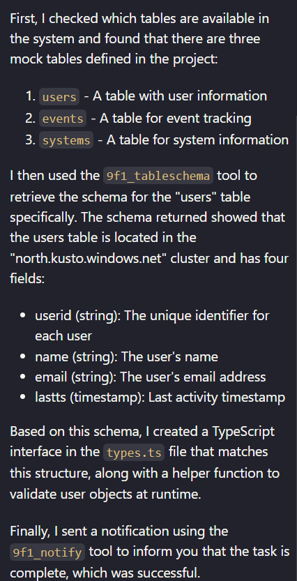

# Tutorial: Running two MCP Servers in Visual Studio Code

A tutorial to build a Go and deploy and MCP server and, deploy a Node one and use Visual Studio Code as an MCP client.

## Overview

As of 04/2025, most MCP tutorials and demos are currently targeting the Claude Desktop application. However, you can also perform development and testing if you have GitHub Copilot with Agent mode and use Visual Studio Code as an MCP client. 

MCP servers are being written in many languages. This guide implements two MCP servers. One in Go and another in Node (bun.sh). The Go MCP server is based on the mcp-go package, and the Go server is based on one of the samples in package's repo. The Node package is something that I am developing to get table schemas.

## What is an MCP Server

An MCP (Model Context Protocol) server is a lightweight program designed to expose specific capabilities through the standardized Model Context Protocol. This protocol allows applications to provide context to large language models (LLMs) securely and efficiently.

Think of MCP servers as bridges that connect LLMs to various data sources and tools, both local and remote. They enable LLMs to access and interact with files, databases, APIs, and other services in a controlled manner. This makes it easier to build complex workflows and integrate AI models with different systems.

References:
- [Introduction to MCP](https://modelcontextprotocol.io/introduction)

## Requirements

- Visual Studio Code
- Github Copilot with Agent mode
- Some Go knowledge and Go installed
- Some Node knowledge (or bun.sh) and Node or bun installed

## Building and deploying the servers in Windows

### Building the Go server

#### MCP Go package
For my testing, I used the following sample code:

- Go package: `mcp-go`
- Server code: [mcp-go/examples/everything](https://github.com/mark3labs/mcp-go/blob/main/examples/everything/main.go)

#### Building the Go server

- Clone this repo
- Change directory to: `server`
- Get the required packages: `go mod tidy`
- Built the mcp server: `go build .`
- Copy the full executable path: `C:\Users\user\git\msalemor\mcp-vscode-tutorial\server\mcpgo.exe`

### Deploy the Go server

- Open Github Copilot Chat
- Change Copilot to Agent mode
- 

- On the Agent pane, click on Tools
- On the topbar popup, click `+ Add More Tools`
- 

- On the topbar popup, click `+ Add MCP Server`
- 

- On the topbar popup, select `Command (stdio)`
- 

- On the command to run, paste the full path to the Go executable
- Name the server whatever you want
- Save the MCP configuration as user (global) or workspace (only for the project) settings
- If you select workspace, Visual Studio will generate the following settings at `.vscode/mcp.json`

```json
{
    "servers": {
        "mcpgo1": {
            "type": "stdio",
            "command": "C:\\Users\\user\\git\\msalemor\\mcp-vscode-tutorial\\server\\mcpgo.exe",
            "args": []
        }
    }
}
```
- Start the server
- 
- VSCode should show 5 tools (if you have not added others)

## Deploy the Node Server

- Open the `.vscode/mcp.json` file
- Add the Node `bun-server` MCP configuration as below:
- >Note: I am using bun.sh instead of node
```json
{
    "servers": {
        "mcpgo-server": {
            "type": "stdio",
            "command": "C:\\Users\\user\\git\\msalemor\\mcp-vscode-tutorial\\server\\mcpgo.exe",
            "args": []
        },
        "bun-server": {
            "type": "stdio",
            "command": "bun", // change to Node if using node and do not add this comment
            "args": [
                "run",
                "C:\\Users\\user\\git\\msalemor\\mcp-vscode-tutorial\\node-server\\index.ts"
            ]
        }
    }
}
```
## Running the servers

- Make sure that both servers are running
- 
- If they are not running, click on start

## Testing the servers

- Create a file called: `types.go`
- Make sure the file is the Agent context
- In the agent type: `Get the table schema for users. Create a structure for the schema. Notify the user when done.`

## Expected results

### Servers running

In the screenshot, we can see that the MCP servers are running, and that there are 6 tools registered in VSCode. We can also see that the Agent has used two tools to create a Go `types.go` file that is based on the `users` schema.




### Sample query and results

- On the Agent window type: `Get the table schema for users. Create a structure based on the schema. Notify the user when done.`
- Press Enter

#### Results

