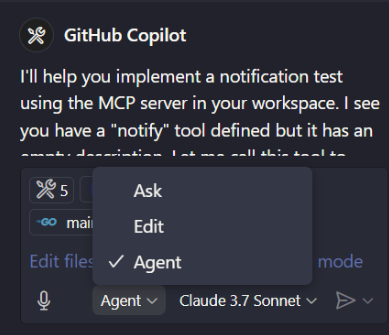

# MCP Server - VSCode Tutorial

A tutorial to build an MCP server and use Visual Studio Code as an MCP client.

## Overview

As of 04/2025, most MCP tutorials and demos are currently targeting the Claude Desktop application. However, you can also perform development and testing if you have GitHub Copilot with Agent mode and use Visual Studio Code as an MCP client. 

MCP servers are being written in many languages. This demo implements a sample MCP server, from the mcp-go package samples, in Go becuse the build process generates a high performant, low resource, and small executable that requires no additional parameters to run. MCP servers can be written in languages like Node, Python, and others.

## What is an MCP Server

An MCP (Model Context Protocol) server is a lightweight program designed to expose specific capabilities through the standardized Model Context Protocol. This protocol allows applications to provide context to large language models (LLMs) securely and efficiently.

Think of MCP servers as bridges that connect LLMs to various data sources and tools, both local and remote. They enable LLMs to access and interact with files, databases, APIs, and other services in a controlled manner. This makes it easier to build complex workflows and integrate AI models with different systems.

References:
- [Introduction to MCP](https://modelcontextprotocol.io/introduction)

## MCP Server code

For my testing, I used the following sample code:

- Go package: `mcp-go`
- Server code: [mcp-go/examples/everything](https://github.com/mark3labs/mcp-go/blob/main/examples/everything/main.go)

## Requirements

- Visual Studio Code
- Github Copilot with Agent mode
- Some Go knowledge

## Building the code in Windows

Note: you can clone the repo and perform other steps, but these are the ones I followed:

- Clone this repo
- Change directory to: `server`
- Get the required packages: `go mod tidy`
- Built the mcp server: `go build .`
- Copy the full executable path: `C:\Users\user\git\msalemor\mcp-vscode-tutorial\server\mcpgo.exe`

## Deploying the server

- Open Github Copilot Chat
- Change Copilot to Agent mode
- 

- On the Agent pane, click on Tools
- On the topbar popup, click `+ Add More Tools`
- 

- On the topbar popup, click `+ Add MCP Server`
- 

- On the topbar popup, select `Command (stdio)`
- 

- On the command to run, paste the full path to the Go executable
- Name the server whatever you want
- Save the MCP configuration as user (global) or workspace (only for the project) settings
- If you select workspace, Visual Studio will generate the following settings at `.vscode/mcp.json`

```json
{
    "servers": {
        "mcpgo1": {
            "type": "stdio",
            "command": "C:\\Users\\user\\git\\msalemor\\mcp-vscode-tutorial\\server\\mcpgo.exe",
            "args": []
        }
    }
}
```
- Start the server
- 
- VSCode should show 5 tools (if you have not added others)

## Expected results

In the screenshot, we can see that the MCP server is running, and that there are 5 tools registered in VSCode. We can also see that the agent has made to calls to `add` and `notify`.


## Testing in the agent type:

- add 1 + 1
```text
I'll help you add 1 + 1 using the available tools in this MCP (Model Context Protocol) server workspace. It looks like you have an "add" tool implemented in your Go server that can handle addition operations.

Let me call the tool to add 1 + 1:

The result of adding 1 + 1 is 2.

I used the "add" tool that's implemented in your MCP server. The server returned: "The sum of 1.000000 and 1.000000 is 2.000000."
```

- Notify: this is a test
```text
I'll help you implement a notification test using the MCP server in your workspace. I see you have a "notify" tool defined but it has an empty description. Let me call this tool to send a notification:

The notification was successfully sent! I used the 9f1_notify tool in your MCP (Model Context Protocol) server, and it returned "notification sent successfully".
```

